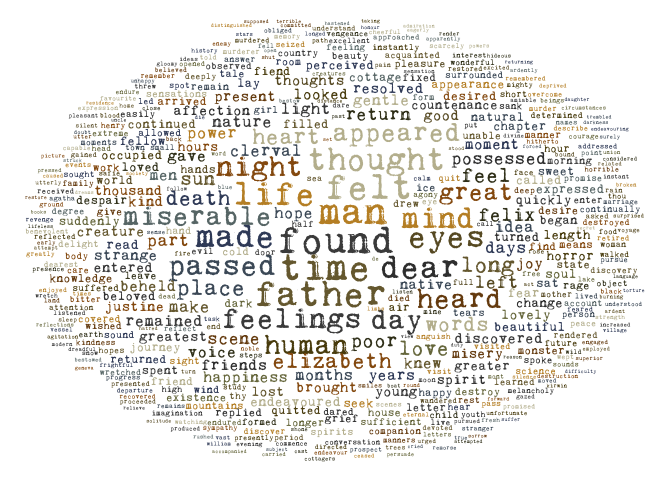
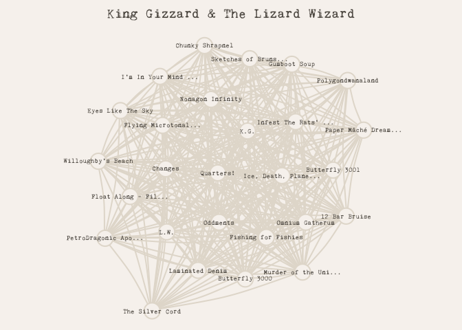

assignment-b4
================
Alma Garcia
2023-12-04

# Strings and functional programming in R

## Exercise 1

For this exercise I chose the book “Frankenstein” by Mary Shelley (a
favorite of mine). The book was downloaded as plain text from [Project
Gutenberg](https://www.gutenberg.org/ebooks/84).

``` r
library(stringr)
library(dplyr)
```

    ## 
    ## Attaching package: 'dplyr'

    ## The following objects are masked from 'package:stats':
    ## 
    ##     filter, lag

    ## The following objects are masked from 'package:base':
    ## 
    ##     intersect, setdiff, setequal, union

``` r
library(tm)
```

    ## Loading required package: NLP

``` r
con <- file("files/frankenstein.txt")
frankenstein_book <- readLines(con) %>% tolower()
head(frankenstein_book)
```

    ## [1] "the project gutenberg ebook of frankenstein; or, the modern prometheus"  
    ## [2] "    "                                                                    
    ## [3] "this ebook is for the use of anyone anywhere in the united states and"   
    ## [4] "most other parts of the world at no cost and with almost no restrictions"
    ## [5] "whatsoever. you may copy it, give it away or re-use it under the terms"  
    ## [6] "of the project gutenberg license included with this ebook or online"

So the book actually starts at line 70 and ends at line 7385, we will
extract the relevant content to work with it. I will also keep lines
that have at least 1 character.

``` r
frankenstein <- frankenstein_book[70:7385] %>%
    str_subset(".+")

head(frankenstein)
```

    ## [1] "letter 1"                                                             
    ## [2] "_to mrs. saville, england._"                                          
    ## [3] "st. petersburgh, dec. 11th, 17—."                                     
    ## [4] "you will rejoice to hear that no disaster has accompanied the"        
    ## [5] "commencement of an enterprise which you have regarded with such evil" 
    ## [6] "forebodings. i arrived here yesterday, and my first task is to assure"

Now we need to create our unique words list.

``` r
frankenstein_words <- frankenstein %>% 
    str_split("\\s+") %>% # split lines into words
    unlist() %>% # break the list structure
    str_replace_all("[:punct:]", " ") %>% # turns punctuation into spaces (because some words have em dashes between)
    str_subset("^[a-z]+$") # filters out punctuation and numbers
```

``` r
head(frankenstein_words, 20)
```

    ##  [1] "letter"       "you"          "will"         "rejoice"      "to"          
    ##  [6] "hear"         "that"         "no"           "disaster"     "has"         
    ## [11] "accompanied"  "the"          "commencement" "of"           "an"          
    ## [16] "enterprise"   "which"        "you"          "have"         "regarded"

And then we need to count the number of unique words so we can create
plots:

``` r
frankenstein_unique <- as_tibble(frankenstein_words) %>%
    filter(!value %in% tm::stopwords("SMART")) %>% # remove stop words
    group_by(value) %>%
    reframe(count = n()) %>%
    rename(word = value) 

head(frankenstein_unique)
```

    ## # A tibble: 6 × 2
    ##   word       count
    ##   <chr>      <int>
    ## 1 abandon        2
    ## 2 abandoned      2
    ## 3 abhor          3
    ## 4 abhorred       7
    ## 5 abhorrence     6
    ## 6 abhorrent      1

To visualize the most used words let’s make a word cloud using the
`wordcloud` package:

``` r
library(wordcloud)
```

    ## Loading required package: RColorBrewer

``` r
# color palette
pal = c("#3C4B69FF", "#4B5A69FF", "#697878FF", "#4B4B4BFF", "#3C3C3CFF", "#3C3C1EFF", "#695A2DFF", "#78693CFF", "#78784BFF", "#C0BB9DFF", "#C2902FFF", "#965A0FFF", "#784B0FFF", "#5A4B0FFF")
```

``` r
wordcloud(frankenstein_unique$word, 
                    frankenstein_unique$count, 
                    max.words = 500,
                    random.order = FALSE, 
                    random.color = TRUE,
                    scale = c(2.5, 0.05), 
                    rot.per=0,
                    fixed.asp = FALSE,
                    family = "Kingthings Trypewriter 2", 
                    font = 1, 
                    col = pal)
```

<!-- -->

And we’ll make another plot, this time a barplot, to show the top 15
words:

``` r
library(ggplot2)
```

    ## 
    ## Attaching package: 'ggplot2'

    ## The following object is masked from 'package:NLP':
    ## 
    ##     annotate

``` r
frankenstein_unique %>%
    arrange(desc(count)) %>%
    slice_head(n = 15) %>%
    ggplot(aes(reorder(word, -count), count)) +
    geom_col(fill = pal[1], position = position_dodge(width=0.5)) +
    xlab("word") +
    scale_y_continuous(expand = c(0,0.15)) +
    theme_minimal() +
    theme(text = element_text(color = pal[1], family = "Kingthings Trypewriter 2"),
                axis.title = element_text(size = 16),
                axis.text = element_text(color = pal[1]),
                axis.text.x = element_text(angle = 30, hjust=1),
                axis.ticks.x.bottom = element_line(linewidth = 0.5, color = "#EBEBEB"),
                panel.grid.major.x = element_blank()
                ) 
```

<!-- -->

## Exercise 3

For this exercise I want to model a difference between albums of some of
my favorite artists: alt-J, Arctic Monkeys, Lana del Rey and King
Gizzard & the Lizard Wizard (KG&LW). For this I previously generated a
dataset using the `spotifyr` package to get the tracks info by these
artists (see `spotify.R`).

The variable I’m most interested in comparing is the `energy` variable.
According to the Spotify API `energy` refers to:

> Energy is a measure from 0.0 to 1.0 and represents a perceptual
> measure of intensity and activity. Typically, energetic tracks feel
> fast, loud, and noisy. For example, death metal has high energy, while
> a Bach prelude scores low on the scale. Perceptual features
> contributing to this attribute include dynamic range, perceived
> loudness, timbre, onset rate, and general entropy.

``` r
library(ggridges)
library(forcats)
library(purrr)
library(broom)
```

``` r
spotify <- read.csv(file = "files/spotify.csv") %>%
    select(-X, track_name, track_number, artist_name, album_name, album_release_year, energy)

artists <- spotify$artist_name %>% unique()

head(spotify)
```

    ##                 track_name artist_name track_number
    ## 1                     Bane       alt-J            1
    ## 2                     U&ME       alt-J            2
    ## 3          Hard Drive Gold       alt-J            3
    ## 4 Happier When You’re Gone       alt-J            4
    ## 5                The Actor       alt-J            5
    ## 6               Get Better       alt-J            6
    ##                        album_name album_release_date album_release_year
    ## 1 The Dream (CARBS Remix Edition)         2023-04-28               2023
    ## 2 The Dream (CARBS Remix Edition)         2023-04-28               2023
    ## 3 The Dream (CARBS Remix Edition)         2023-04-28               2023
    ## 4 The Dream (CARBS Remix Edition)         2023-04-28               2023
    ## 5 The Dream (CARBS Remix Edition)         2023-04-28               2023
    ## 6 The Dream (CARBS Remix Edition)         2023-04-28               2023
    ##   danceability energy loudness duration_ms   tempo valence
    ## 1        0.359  0.464   -8.954      310000 139.622  0.0758
    ## 2        0.587  0.722   -8.332      198840  81.973  0.2940
    ## 3        0.670  0.853   -5.962      158480 144.272  0.6840
    ## 4        0.543  0.461   -9.275      240480 133.998  0.1990
    ## 5        0.625  0.604   -8.330      240893 147.987  0.6240
    ## 6        0.592  0.116  -19.498      351293 106.086  0.4660

There are some albums in the dataset that are repeated, are remixes, or
live recordings. I will remove those and keep only the artist’s distinct
albums.

``` r
rm_albums <- c("Born To Die", "Born To Die – Paradise Edition (Special Version)", "Born To Die - The Paradise Edition", "Live at the Royal Albert Hall", "This Is All Yours (Album Commentary)", "Reduxer", "The Dream","The Dream (CARBS Remix Edition)", "Live In San Francisco ’16")

spotify_distinct <- spotify %>%
    filter(!album_name %in% rm_albums) 
```

Let’s do some plotting to visualize the differences in energy across
time.

``` r
spotify_distinct %>%
        ggplot(aes(x = album_release_year, y = energy)) +
        geom_jitter() +
        theme_bw() +
        facet_wrap(~artist_name)
```

<!-- -->

There seems to be a somewhat negative trend for Lana del Rey’s music
getting less energetic throughout the years. Arctic Monkey’s las album
also seems to be much more less energetic than the rest. alt-J doesn’t
show much difference, and KG&LW is all over the place.

Another plot that can help visualize this evolution is a ridgeline plot.

``` r
plot_func <- function(name, df) {
    df %>%
        filter(artist_name == name) %>%
        ggplot(aes(y=fct_reorder(album_name, -album_release_year), 
                         x=energy, 
                         fill=as.factor(album_release_year)
                         )
                 ) +
    geom_density_ridges(aes(height = after_stat(density)), stat = "density", scale = 0.95, color = "#00000040") +
    scale_y_discrete(label = function(x) stringr::str_trunc(x, 20)) +
    scale_fill_discrete(name = "year") +
    ggtitle(name) +
    theme_minimal() +
    theme(
        axis.title.y = element_blank(),
        panel.grid.major.y = element_line(colour = "gray80", linewidth = 0.3),
        panel.grid.major.x = element_line(colour = "gray80", linewidth = 0.3),
        panel.grid.minor.x = element_line(colour = "gray80", linewidth = 0.3),
    ) 
}
```

``` r
walk(artists, \(x) {p <- plot_func(x,spotify_distinct) 
         print(p)}
         )
```

<!-- --><!-- --><!-- --><!-- -->

So alt-J seems to show little change in energy between albums. Arctic
Monkeys and Lana del Rey show a decrease in energy as the years pass.
KG&LW usually maintains a relatively high energy throughout their albums
with some outliers.

There are two ways to model this: first a linear regression model to
find possible trends in energy across time, the second is an ANOVA test
to determine the statistical differences in the mean energy between each
album. I will need to assume three things for this analysis:

1.  that the data is independent,
2.  that the data is normally distributed
3.  that the data has common variance

These assumptions are not true but will have to be so for the purposes
of this exercise 😅.

For these steps I’ll create a new tibble with the nested dataframes, one
for each artist:

``` r
library(tidyr)

spotify_artists <- spotify_distinct %>% 
    nest(.by = artist_name)

spotify_artists
```

    ## # A tibble: 4 × 2
    ##   artist_name                      data               
    ##   <chr>                            <list>             
    ## 1 alt-J                            <tibble [53 × 11]> 
    ## 2 Arctic Monkeys                   <tibble [80 × 11]> 
    ## 3 Lana Del Rey                     <tibble [123 × 11]>
    ## 4 King Gizzard & The Lizard Wizard <tibble [287 × 11]>

## linear model

Now I can fit the linear model and get two important parameters out of
it: the slope and the adjusted r squared value

``` r
spotify_models <- spotify_artists %>%
    mutate(linear_models = map(data, \(x) lm(energy ~ album_release_year, x)),
                 coef = map_dbl(linear_models, \(x) coef(x) %>% .[[2]]),
                 adj_r_sq = map_dbl(linear_models, \(x) summary(x) %>% .$adj.r.squared))

names(spotify_models$data) <- artists

spotify_models
```

    ## # A tibble: 4 × 5
    ##   artist_name                      data         linear_models     coef adj_r_sq
    ##   <chr>                            <named list> <list>           <dbl>    <dbl>
    ## 1 alt-J                            <tibble>     <lm>           0.00834 -0.00115
    ## 2 Arctic Monkeys                   <tibble>     <lm>          -0.0248   0.419  
    ## 3 Lana Del Rey                     <tibble>     <lm>          -0.0332   0.441  
    ## 4 King Gizzard & The Lizard Wizard <tibble>     <lm>           0.00167 -0.00222

So as we could see before, both Arctic Monkeys and Lana del Rey have a
negative trend of energy across time (negative slope), with a more
pronounced decline in Lana del Rey. However the adjusted R squared value
is not particularly high, meaning that the model isn’t that well of a
fit. In the case of alt-J and KG&LW there is no significant trend and
the model doesn’t predict at all the behavior of energy across time
(notice the negative `adj_r_sq`).

However after looking at the distribution plots I’m sure there are at
least some albums whose average energy is significantly different from
the others, at least for Arctic Monkeys, Lana del Rey, and KG&LW. So
I’ll do an anova model too to determine if there are at least 1 album
with a significantly different mean energy than the others for each
artist.

``` r
spotify_models <- spotify_models %>%
    mutate(aov = map(data, \(x) aov(energy ~ album_name, x)),
                 aov_summary = map(aov, broom::tidy)
                 ) 
names(spotify_models$aov) <- artists
names(spotify_models$aov_summary) <- artists
```

``` r
spotify_models %>%
    unnest(aov_summary) %>%
    filter(term != "Residuals") %>%
    select(artist_name,p.value)
```

    ## # A tibble: 4 × 2
    ##   artist_name                       p.value
    ##   <chr>                               <dbl>
    ## 1 alt-J                            5.78e- 1
    ## 2 Arctic Monkeys                   4.98e-13
    ## 3 Lana Del Rey                     2.17e-16
    ## 4 King Gizzard & The Lizard Wizard 2.86e- 6

We can see from the p.values that for Arctic Monkeys, Lana del Rey, and
KG&LW there is at least 1 album that has a significantly different mean
energy from the rest. So now I can perform a Tukey HSD test to see
exactly which albums have significantly different mean energy from each
other.

``` r
spotify_models <- spotify_models %>%
    mutate(tukey = map(aov, \(x) TukeyHSD(x) %>% broom::tidy()))

names(spotify_models$tukey) <- artists
```

``` r
spotify_models %>%
    unnest(tukey) %>%
    filter(adj.p.value < 0.05) %>%
    select(artist_name, contrast, estimate, conf.low, conf.high)
```

    ## # A tibble: 34 × 5
    ##    artist_name    contrast                           estimate conf.low conf.high
    ##    <chr>          <chr>                                 <dbl>    <dbl>     <dbl>
    ##  1 Arctic Monkeys Favourite Worst Nightmare (Standa…    0.196   0.0306     0.361
    ##  2 Arctic Monkeys Suck It and See-AM                    0.219   0.0541     0.384
    ##  3 Arctic Monkeys The Car-AM                           -0.286  -0.459     -0.113
    ##  4 Arctic Monkeys Whatever People Say I Am, That's …    0.191   0.0289     0.353
    ##  5 Arctic Monkeys The Car-Favourite Worst Nightmare…   -0.482  -0.655     -0.309
    ##  6 Arctic Monkeys The Car-Humbug                       -0.413  -0.594     -0.233
    ##  7 Arctic Monkeys The Car-Suck It and See              -0.505  -0.678     -0.332
    ##  8 Arctic Monkeys Tranquility Base Hotel & Casino-T…    0.361   0.185      0.538
    ##  9 Arctic Monkeys Whatever People Say I Am, That's …    0.477   0.307      0.647
    ## 10 Lana Del Rey   Born To Die (Deluxe Version)-Blue…    0.390   0.229      0.551
    ## # ℹ 24 more rows

The adjusted P value determines if the pairwise comparison (`contrast`)
is significantly different (p \< 0.05) or not, here I filtered for only
significantly different comparisons (p \< 0.05). alt-J has none and it’s
interesting to see that KG&LW has less pairs of albums with
significantly different mean energy than Lana del Rey and Arctic Monkeys
(8 pairs vs 17 and 9 respectively).

Now I’ll make some final plots to show the relationship between albums,
the idea is to connect albums that are similar to each other. I’ll first
make a matrix that contains a 1 if the albums mean energy is
significantly similar, then I’ll make a network graph.

``` r
library(igraph)
```

    ## 
    ## Attaching package: 'igraph'

    ## The following object is masked from 'package:tidyr':
    ## 
    ##     crossing

    ## The following objects are masked from 'package:purrr':
    ## 
    ##     compose, simplify

    ## The following objects are masked from 'package:dplyr':
    ## 
    ##     as_data_frame, groups, union

    ## The following objects are masked from 'package:stats':
    ## 
    ##     decompose, spectrum

    ## The following object is masked from 'package:base':
    ## 
    ##     union

``` r
gen_comparison_matrix <- function(df, tukey_results) {
    similar_albums <- tukey_results %>% filter(adj.p.value > 0.05)
    
    n = length(unique(df$album_name))
    
    album_matrix <- matrix(0, nrow = n, ncol = n)
    rownames(album_matrix) <- colnames(album_matrix) <- levels(fct_reorder(df$album_name, df$album_release_year))
    
    for (albums in similar_albums$contrast) {
        album_sep <- str_split_1(albums, "-")
        album_matrix[album_sep[1],album_sep[2]] <- 1
        album_matrix[album_sep[2],album_sep[1]] <- 1
    }
    album_matrix
}

spotify_models <- spotify_models %>%
    mutate(album_matrix = map2(data, tukey, \(x,y) gen_comparison_matrix(x,y)))
```

``` r
gen_network_plots <- function(artist, matrix) {
    labels <- rownames(matrix) %>% str_trunc(20)
    network <- graph_from_adjacency_matrix(matrix, mode="undirected")
    par(bg="#F7F3EF", mar=c(0,0,2,0))
    set.seed(5)
    plot(network,
    vertex.size=12,
    vertex.color="#F7F3EF", 
    vertex.label=labels,
    vertex.label.cex=0.6,
    vertex.label.color="#605A52",
        vertex.label.family="Kingthings Trypewriter 2",
    vertex.frame.color="#E4DDD2",
        vertex.frame.width = 2,
        edge.color="#E4DDD2",
        edge.width=2,
        edge.curved=0.1
    )
    title(artist,
                family = "Kingthings Trypewriter 2",
                col.main = "#605A52",
                cex.main = 1.2)
}

walk2(artists, spotify_models$album_matrix, \(x,y) gen_network_plots(x,y))
```

<!-- --><!-- --><!-- --><!-- -->

So here we have the visual representation of the relationships of the
mean energy between each album, if albums (nodes) are connected it means
that their mean energy is not statistically different (p \< 0.05). It’s
very interesting to see how certain albums cluster together like Lana
del Rey’s most recent albums: Blue Banister, Chemtrails Over the Country
Club, Norman Fucking Rockwell!, and Did you know that there’s a tunnel
under ocean boulevard? and how Honeymoon is at the center of both
clusters. It is also evident that The Car’s mean energy is significantly
different from the other Arctic Monkey’s albums. KG&LW is pretty
messing, they have a ton of albums so it’s kinda hard to read 😅

It would’ve been interesting to include other metrics such as loudness,
danceability and valence into the anova models, but I wanted to keep it
relatively simple. :)
